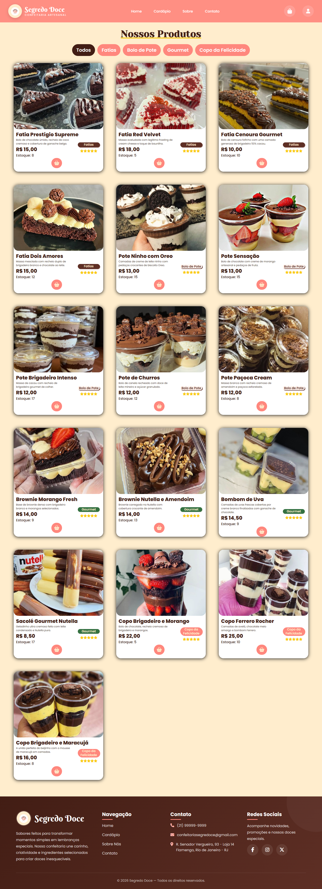
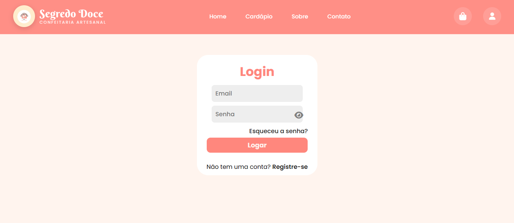
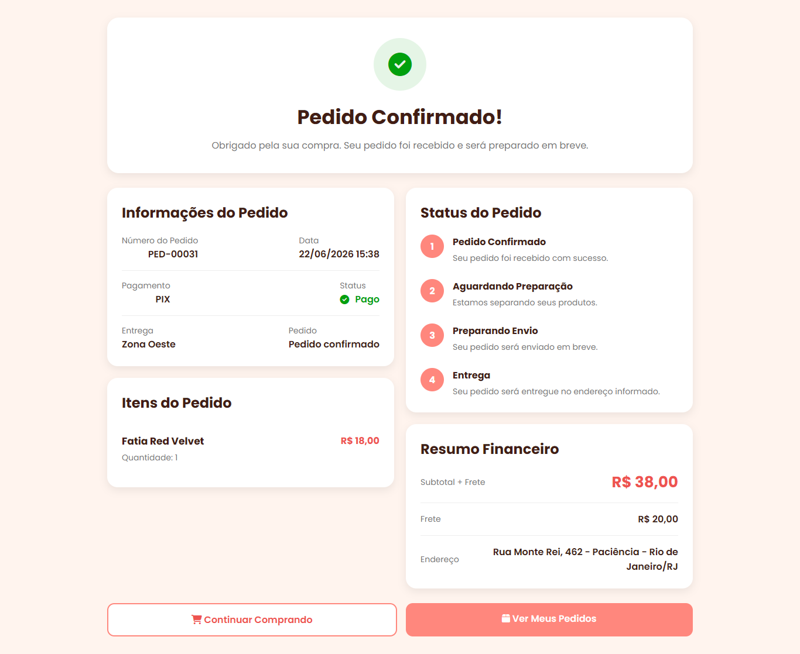
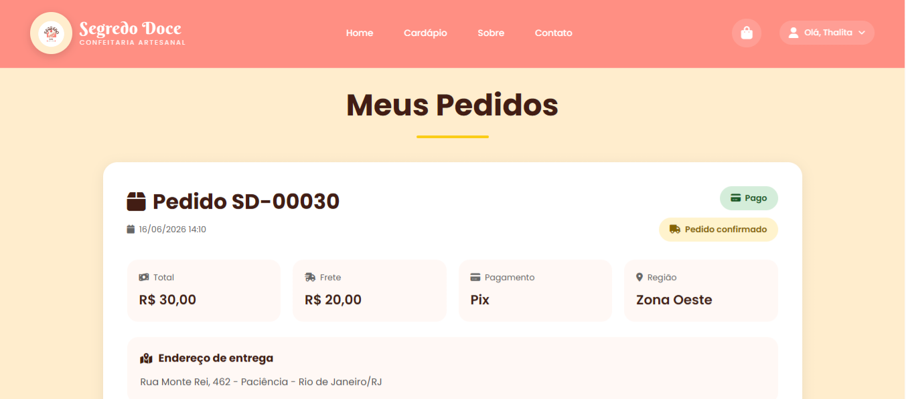
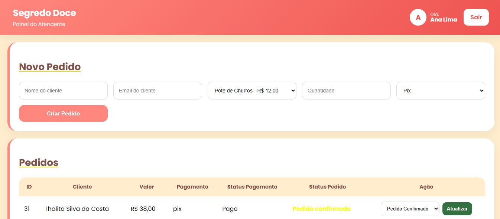
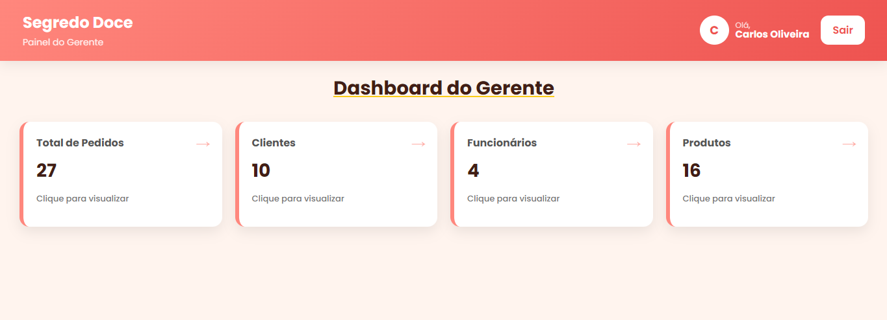
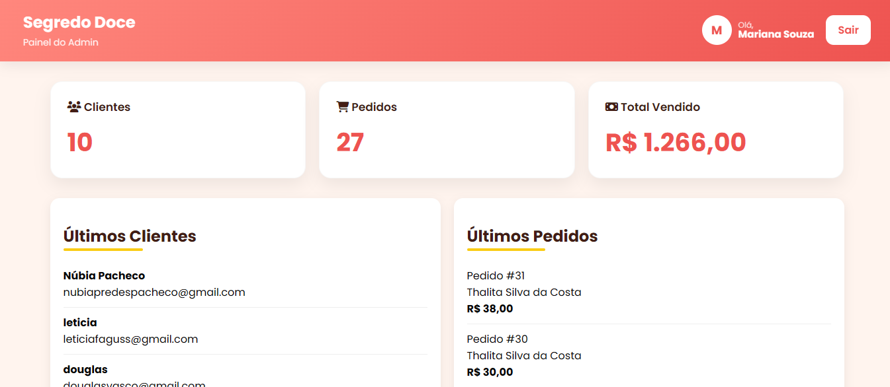

# 🍰 Segredo Doce

Sistema web desenvolvido para uma confeitaria, oferecendo compra online de produtos e gerenciamento completo por meio de diferentes níveis de acesso.

## 🌐 Demonstração

🔗 https://segredodoce.onrender.com

> **Observação:** Como o sistema está hospedado no plano gratuito do Render, o primeiro acesso pode levar alguns segundos para carregar.

---

## 🚀 Tecnologias Utilizadas

- HTML5
- CSS3
- JavaScript
- PHP
- PostgreSQL
- SendGrid
- Render

---

## ✨ Funcionalidades

- Cadastro de usuários
- Login
- Recuperação de senha por e-mail
- Catálogo de produtos
- Carrinho de compras
- Finalização de pedidos
- Histórico de pedidos
- Controle de pedidos
- Gerenciamento de produtos
- Gerenciamento de funcionários
- Controle de permissões
- Painéis administrativos

---

## 👥 Níveis de Acesso

O sistema foi desenvolvido com quatro níveis de acesso independentes, garantindo que cada usuário visualize apenas as funcionalidades correspondentes ao seu perfil.

- 👤 Cliente
- 🧑‍🍳 Atendente
- 👔 Gerente
- 👑 Administrador

---

## 📸 Principais Telas

### 🏠 Página Inicial

Página inicial da Segredo Doce, desenvolvida para apresentar a confeitaria, seus produtos, categorias, avaliações de clientes, diferenciais da empresa e informações para contato e encomendas.

---

### 🛍️ Catálogo de Produtos

Catálogo de produtos com imagens, descrições, categorias identificadas por cores, avaliações, preços, estoque e opção para adicionar os itens ao carrinho.

---

### 🔐 Autenticação

Sistema de autenticação responsável por identificar o usuário e direcioná-lo automaticamente para o painel correspondente ao seu nível de acesso.

---

### ✅ Confirmação do Pedido

Após finalizar uma compra, o sistema apresenta um resumo completo do pedido contendo os produtos adquiridos, endereço de entrega, frete e valor total da compra.

---

### 📦 Histórico de Pedidos

Área destinada ao cliente para acompanhar todos os pedidos realizados, organizados de forma prática e intuitiva.

---

### 🧑‍🍳 Painel do Atendente

Painel desenvolvido para auxiliar o atendimento diário, permitindo cadastrar novos pedidos e atualizar o status das encomendas.

---

### 👔 Painel do Gerente

Área gerencial com acesso aos dados de clientes, pedidos, produtos e funcionários, permitindo acompanhar as informações por meio de tabelas organizadas e indicadores rápidos.

---

### 👑 Painel do Administrador

Painel administrativo completo contendo indicadores do sistema, faturamento, últimos pedidos, últimos clientes, gerenciamento de gerentes e acesso às principais informações para administração da plataforma.

